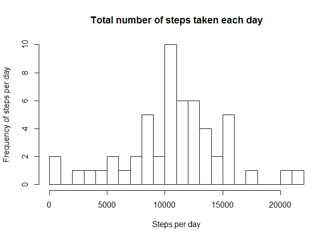
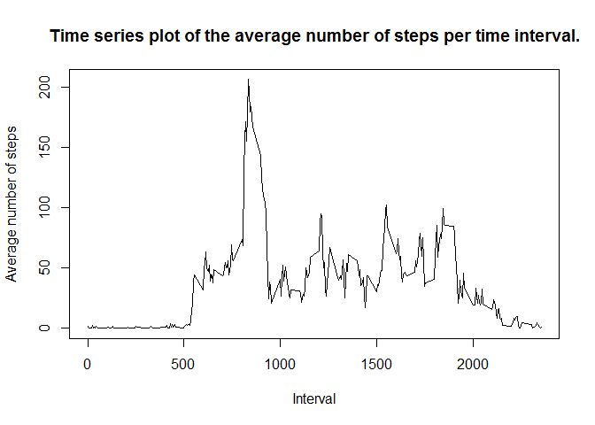
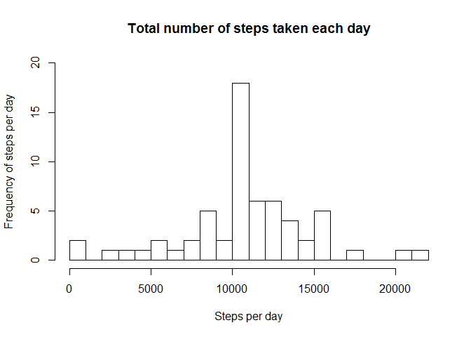
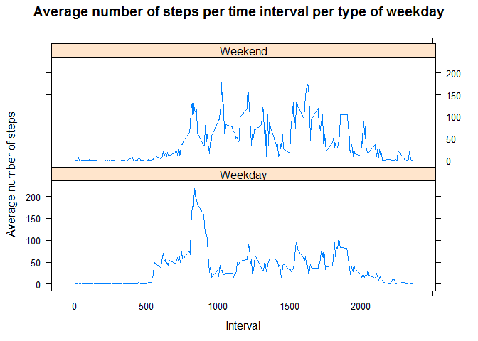

# Reproducible Research: Peer Assessment 1


## Loading and preprocessing the data
First make sure that in your working directory the data is present.
Then do the loading and preprocessing the data, making sure the date field is indeed a date field.


```r
activitydata<-read.csv("activity.csv", colClasses=c("numeric","character","numeric"))
str(activitydata)
```

```
## 'data.frame':	17568 obs. of  3 variables:
##  $ steps   : num  NA NA NA NA NA NA NA NA NA NA ...
##  $ date    : chr  "2012-10-01" "2012-10-01" "2012-10-01" "2012-10-01" ...
##  $ interval: num  0 5 10 15 20 25 30 35 40 45 ...
```

```r
activitydata$date<-as.Date(activitydata$date,format="%Y-%m-%d")
str(activitydata)
```

```
## 'data.frame':	17568 obs. of  3 variables:
##  $ steps   : num  NA NA NA NA NA NA NA NA NA NA ...
##  $ date    : Date, format: "2012-10-01" "2012-10-01" ...
##  $ interval: num  0 5 10 15 20 25 30 35 40 45 ...
```


## What is mean total number of steps taken per day?
We've calculated the number of steps taken per day and show that in a histogram.
Here we can omit the NA values so first we do that.

```r
activitydata1<-na.omit(activitydata)
str(activitydata1)
```

```
## 'data.frame':	15264 obs. of  3 variables:
##  $ steps   : num  0 0 0 0 0 0 0 0 0 0 ...
##  $ date    : Date, format: "2012-10-02" "2012-10-02" ...
##  $ interval: num  0 5 10 15 20 25 30 35 40 45 ...
##  - attr(*, "na.action")=Class 'omit'  Named int [1:2304] 1 2 3 4 5 6 7 8 9 10 ...
##   .. ..- attr(*, "names")= chr [1:2304] "1" "2" "3" "4" ...
```

```r
steps_per_day<-tapply(activitydata1$steps,activitydata1$date,sum)
hist(steps_per_day, main="Total number of steps taken each day", breaks=30,xlab="Steps per day", ylab="Frequency of steps per day")
```

 

Then calculate and report the mean of the total number of steps taken per day.

```r
mean(steps_per_day)
```

```
## [1] 10766.19
```

Then calculate and report the median of the total number of steps taken per day.

```r
median(steps_per_day)
```

```
## [1] 10765
```


## What is the average daily activity pattern?
To see what the average daily activity pattern is first we made a plot of the 5-minute interval and the average number of steps taken, averaged across all days.

```r
steps_per_interval<-tapply(activitydata1$steps,activitydata1$interval,mean)
plot(x=names(steps_per_interval),y=steps_per_interval,type="l",xlab="Interval", ylab="Average number of steps", main="Time series plot of the average number of steps per time interval.")
```

 

Then see which 5-minute interval will have the maximum number of steps (on average across all days)

```r
max(steps_per_interval)
```

```
## [1] 206.1698
```


## Imputing missing values
We calculate how many rows there are with NA's in it.

```r
sum(is.na(activitydata))
```

```
## [1] 2304
```

The presence of missing days/intervals may introduce bias into some calculations or summaries of the data.
Impute the missing values for the steps with the average number of steps for that time interval. 

```r
activitydata_filled<-activitydata
activitydata_filled[which(is.na(activitydata_filled$steps)),1]<-steps_per_interval[as.character(activitydata_filled[which(is.na(activitydata_filled$steps)),3])]
```

Make a histogram of the total number of steps taken each day and calculate and report the mean and median total number of steps taken per day. Do these values differ from the estimates from the first part of the assignment? What is the impact of imputing missing data on the estimates of the total daily number of steps?


```r
steps_per_day_full<-tapply(activitydata_filled$steps,activitydata_filled$date,sum)
hist(steps_per_day_full, main="Total number of steps taken each day", breaks=30,xlab="Steps per day", ylab="Frequency of steps per day",ylim=c(0,20))
```

 

```r
mean(steps_per_day_full)
```

```
## [1] 10766.19
```

```r
median(steps_per_day_full)
```

```
## [1] 10766.19
```

As you can see above the mean stayed the same while the median changed a bit and became equal to the mean.

## Are there differences in activity patterns between weekdays and weekends?
First at a variable indicating whether or not the day is a weekday or in the weekend is added to the dataset.

```r
activitydata_filled$weekday<-as.factor(ifelse(weekdays(activitydata_filled$date) %in% c("Saterday","Sunday"), "Weekend", "Weekday"))
```

Then we make a plot showing the average number of steps for each time interval for both weekdays and weekend days. 


```r
steps_per_interval_typeday<-aggregate(steps~interval+weekday,data=activitydata_filled, FUN=mean)
library(lattice)
xyplot(steps~interval|weekday, data=steps_per_interval_typeday, layout=c(1,2), type="l", xlab="Interval",ylab="Average number of steps", main="Average number of steps per time interval per type of weekday")
```

 


As you can see in the plots above there are some differences in the average number of steps per interval. In the weekdays there is more activity in the early morning, on the weekend days the average number of steps are more spread out during the day.
